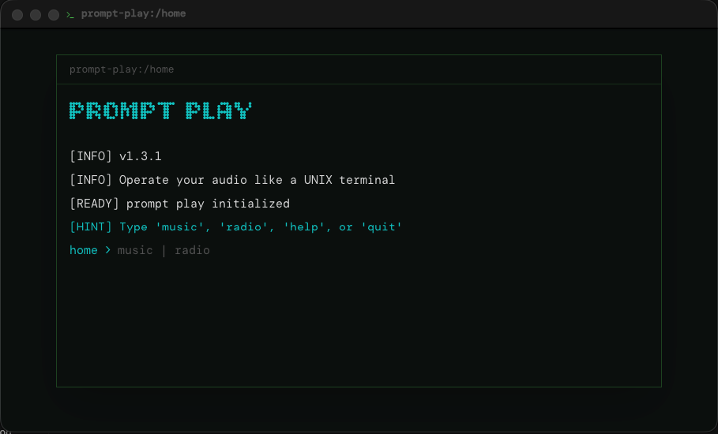
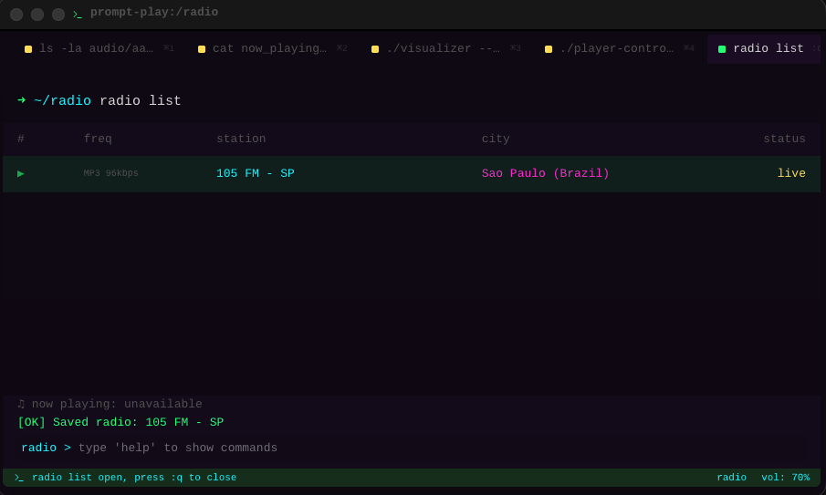
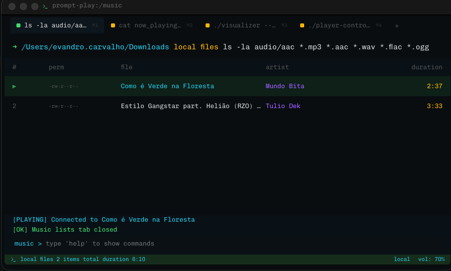
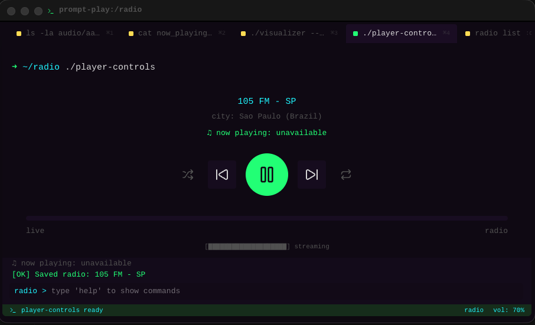
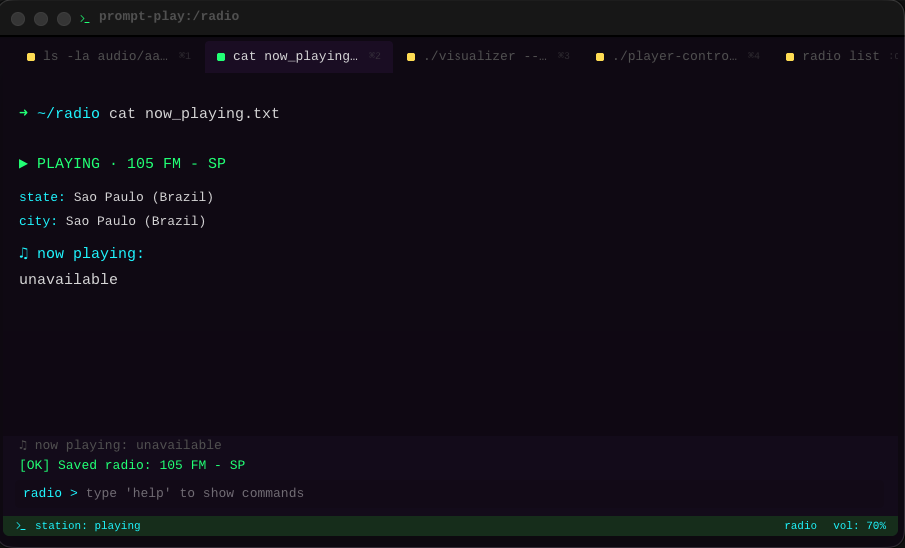
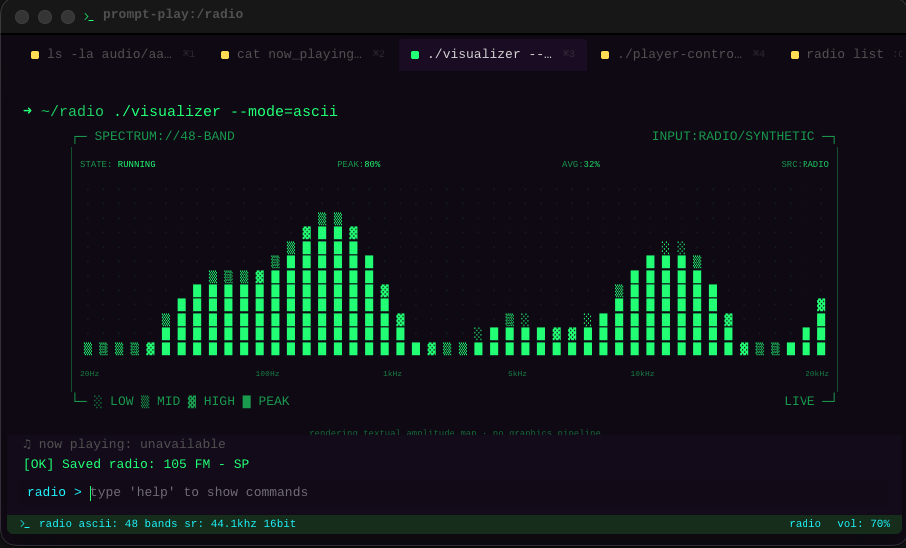
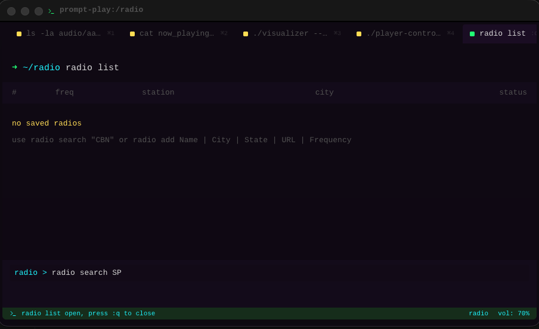
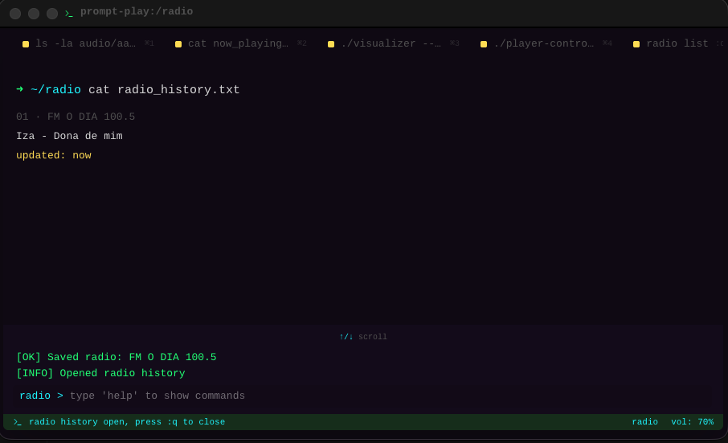
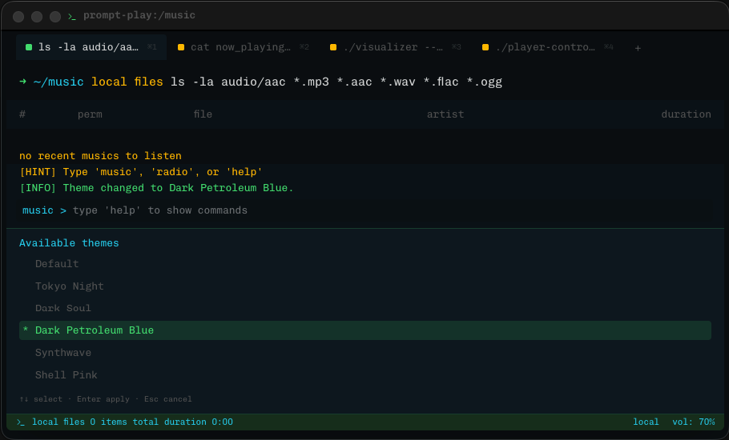

# Prompt Play

Prompt Play is an Electron desktop music player with a terminal-style
interface. It supports local music folders and online radio streams from one
shared player UI.

## Why Prompt Play exists

I enjoy listening to FM radio every day, but I never found a desktop player
that felt right.

Most applications rely on large interfaces, mouse navigation, and endless lists
of stations.

Prompt Play explores a different idea:

What if listening to radio and music felt like using a terminal?

Instead of menus, everything happens through commands.

The terminal isn't the theme.
It's the interface.

## Security Notice

Prompt Play is open source.

Because the application is not currently code signed, Windows SmartScreen and
macOS Gatekeeper may display security warnings during installation.

The source code is available for inspection:

https://github.com/devevandro/prompt-play

## Features

- Local music folder scanning with persisted libraries.
- MP3 title, artist, album, and duration metadata when available.
- Local playback through a secure Electron `local-audio:` protocol with range
  requests and CORS support.
- Online radio mode with saved stations, Radio Browser search for Brazilian
  stations, manual station management, stream status checks, live song
  metadata, and in-session song history.
- Source-aware player controls, seek handling for local files, status footer,
  and a terminal-green ASCII/TUI visualizer.
- Terminal commands for playback, sources, volume, tabs, themes, radio
  management, and app navigation.
- Shuffle, repeat, mute, and unmute controls across supported sources.
- Theme picker with terminal-inspired themes, each with its own monospace font.

## Screenshots

### Home



### Radio Playback



### Local Music Playback



### Player Controls



### Now Playing



### Visualizer



### Radio Search



### Radio Music History



### Themes



## Requirements

- Node.js compatible with the project dependencies.
- Yarn `1.22.22`, as declared in `package.json`.

## Development

Install dependencies:

```sh
yarn install
```

Start the Electron Vite development app:

```sh
yarn dev
```

Build the Electron Vite app:

```sh
yarn compile:app
```

Preview the built app:

```sh
yarn start
```

Run validation:

```sh
yarn typecheck
yarn lint
```

Package the app with Electron Builder:

```sh
yarn build
```

## Core Commands

First access:

| Command | Action |
| --- | --- |
| `music` | Open local music mode. |
| `radio` or `fm` | Open radio mode. |
| `help` | Show the first access hint. |
| `quit` | Close the app. |

Playback:

| Command | Action |
| --- | --- |
| `play` | Play the selected item or first item in the active source. |
| `play 1` | Play an item by list position. |
| `play [name]` | Play the first item matching title, artist, station, or city. |
| `pause` or `stop` | Pause playback. |
| `resume` | Resume playback. |
| `next` or `n` | Play the next item. |
| `prev` or `p` | Play the previous item. |
| `shuffle` | Toggle random playback order. |
| `repeat` | Toggle repeat for the current item. |

Local music:

| Command | Action |
| --- | --- |
| `music -- path [path]` | Scan and store a music folder, then make it active. |
| `music config` | Select a music folder with the native folder picker and make it active. |
| `music list` | Open the temporary saved-folder list tab. |
| `music clear` or `music reset` | Remove saved music folders and cached music lists. |
| `ls -la` | Open the active source list tab. |

Sources and radio:

| Command | Action |
| --- | --- |
| `sources` | Show available sources. |
| `source local` | Switch to local files. |
| `source radio` | Switch to radio. |
| `radio list` or `ls -ra` | Open saved radios. |
| `radio search "CBN"` | Search Brazilian stations through Radio Browser. |
| `radio add 1` | Save a radio from the current search results. |
| `radio add Name \| City \| State \| URL \| Frequency` | Save a manual radio station. |
| `radio edit 1 Name \| City \| State \| URL \| Frequency` | Edit a saved station. |
| `radio remove 1` | Remove a saved station. |
| `radio clear` | Remove all saved stations. |
| `radio export` | Export saved radios as JSON in Downloads. |
| `radio import` | Import saved radios from JSON. |
| `radio import external` | Import externally prepared radio JSON. |
| `radio pin 1` | Pin a saved station into the radio `ls -la` list. |
| `radio pins` | Show pinned stations for radio `ls -la`. |
| `radio unpin 1` | Remove a station from the pinned `ls -la` list. |
| `radio history` | Open `cat radio_history.txt` with up to 10 songs heard in the current session. |
| `radio search music 1` | Open a YouTube search for a radio-history song. |
| `settings radio.static on` | Enable the optional tuning sound while radio buffering takes longer than 1 second. |
| `settings radio.static off` | Disable the optional radio tuning sound. |

Radio playback reads live ICY metadata when the stream provides it. FM O Dia
uses its dedicated live-information endpoint when the station name is
`FM O DIA 100.5`. The current song appears below the connection message, in
`cat now_playing.txt`, and in `./player-controls`. When no song is available,
the player displays
`♫ now playing: unavailable`. Only valid song metadata is stored in
`radio history`.

Tabs and utility:

| Command | Action |
| --- | --- |
| `open now-playing` | Open `cat now_playing.txt`. |
| `open visualizer` or `visualizer ascii` | Open the terminal-green `./visualizer --mode=ascii` TUI. |
| `open controls` | Open `./player-controls`. |
| `tab [number]` | Open a tab by position. |
| `theme list` or `ls -th` | Open the theme picker. |
| `theme use [theme]` | Apply a theme. |
| `vol 70`, `vol +10`, `vol -10` | Set or adjust volume. |
| `+`, `=`, `-` | Adjust volume from an empty terminal prompt. |
| `mute` or `unmute` | Mute playback or restore the previous volume. |
| `copy error` | Copy the latest playback error details. |
| `settings radio.static on/off` | Enable or disable the optional radio tuning sound. |
| `status` or `info` | Show current playback status. |
| `:q` | Close a temporary tab. |
| `clear` | Clear terminal history. |
| `clear playback` | Stop playback without removing saved data. |
| `clear all` | Stop playback and remove saved Electron Storage data. |
| `home` or `exit` | Return to first access. |

See [commands.md](commands.md) for the full command reference.

## Themes

Themes can be selected with `theme list`, `ls -th`, or `theme use [theme]`.
`theme use [theme]` accepts ids such as `dark-soul` and names such as
`dark soul`. Each theme applies its own font family through the shared terminal
typography tokens and is persisted for the next launch.

| Theme | Command id | Font family |
| --- | --- | --- |
| Default | `default` | DM Mono |
| Tokyo Night | `tokyo-night` | Space Mono |
| Dark Soul | `dark-soul` | Cousine |
| Dark Petroleum Blue | `dark-petroleum-blue` | Chivo Mono |
| Shell Pink | `shell-pink` | Lekton |
| Synthwave | `synthwave` | Cousine |

Shell Pink uses a slightly larger text scale and line height so Lekton remains
readable in the terminal interface.

## Suggested Release

Suggested next version: `1.3.1`.

This can be a patch release because it refines the existing `1.3.0` radio
release rather than adding a new playback source. It improves radio export and
import, saved-radio control for `ls -la`, terminal shortcuts, first-access
presentation, and error handling.

## Current Release Highlights

- `radio export` writes timestamped JSON files directly to Downloads.
- `radio import` and `radio import external` merge saved radio JSON.
- `radio pin`, `radio pins`, and `radio unpin` control which saved radios
  appear in radio `ls -la`.
- Radio Browser search now returns a larger deduplicated result set.
- Header text now reflects the active terminal session.
- Home uses a terminal-style presentation with the Bitcount Prop Double title
  font.
- `+`, `=`, and `-` adjust volume from an empty terminal prompt.
- `copy error` copies the most recent playback error details.
- `radio search music [number]` for opening a YouTube search from radio
  history.
- Optional radio tuning sound while stream buffering lasts longer than 1
  second.
- Terminal-green ASCII/TUI spectrum visualizer as the single visualizer mode.

## Project Structure

- `src/main`: Electron main process, IPC handlers, radio stream checks, Radio
  Browser integration, local music scanning, and the `local-audio:` protocol.
- `src/preload`: Safe renderer bridge exposed as `window.App`.
- `src/renderer`: React UI, screens, hooks, terminal flow, and player
  components.
- `src/shared`: Shared types, constants, and utilities.
- `src/lib/electron-app`: Electron setup helpers, factories, release scripts,
  and bundled dev tooling.

## Local Audio Notes

Local files are not loaded with direct `file://` URLs. The main process serves
them through `local-audio:` so Chromium can stream them with byte ranges and the
renderer can use the Web Audio API for visualization. The renderer CSP in
`src/renderer/index.html` must explicitly allow `local-audio:` in `media-src`.

## Radio Notes

Saved radios live under `prompt-play-radios` in Electron Storage. The radio
list opens in saved mode by default, while `radio search [term]` switches the
same tab into search mode and queries Radio Browser for Brazilian stations by
name, state, and tag.

Use `radio add [number]` to save a search result, or use
`radio add Name | City | State | URL | Frequency` to create a station manually.
The `Frequency` field is optional and defaults to `stream`. `radio edit` keeps
the saved station id while replacing the station details, and `radio remove`
also removes the station from the recent-radio list.

The radio static setting lives under `prompt-play-settings`. When enabled, the
player waits 1 second before playing `src/shared/sounds/tuning-in.mp3` during
radio buffering. Fast connections stay silent; slow connections keep the effect
running until the stream reports that audio is ready.

## Storage Notes

Prompt Play persists app data through Electron Storage under the app user-data
directory. Saved music folders live under `prompt-play-music-libraries`, saved
radios live under `prompt-play-radios`, app settings live under
`prompt-play-settings`, and the active theme lives under `prompt-play-theme`.

In local music mode, the last folder selected with `music -- path [path]` or
`music config` is the active folder for `list`, `ls -la`, `play`, and the
playback queue; older saved folders remain available in `music list` but are
not merged into the active music list. `clear playback` stops playback without
removing saved data, while `clear all` stops playback and removes saved
Electron Storage data. Use `music clear` to reset saved music folders only, or
`radio clear` to reset saved radios only.

## Documentation

- [commands.md](commands.md): terminal command reference.
- [AGENTS.md](AGENTS.md): repository guidance for maintainers and coding
  agents.
- [RELEASE_NOTES_1.3.1.md](RELEASE_NOTES_1.3.1.md): suggested release notes
  for the next version.
